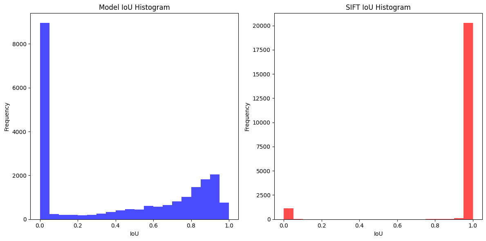

# Template Matching Using Deep Learning
An experiment to do template matching based on neural networks.

<div align="center">
    
</div>

## Training Procedure
* Prepare a `.venv` file that contains following:

```env
TRAIN_DIR=assets/training_data/train2017/train2017
TRAIN_ANNOTATION_DIR=assets/training_data/annotations_trainval2017/annotations/instances_train2017.json
VAL_DIR=assets/training_data/val2017/val2017
VAL_ANNOTATION_DIR=assets/training_data/annotations_trainval2017/annotations/instances_val2017.json
```

Had to do this to make it compatible with HPC. Slurm job is in [scripts](/scripts).

* A model is defined at [temp_matching/model.py](temp_matching/model.py). By default, the encodings will be multiplied.
* A dataset handler is at [temp_matching/data_handler.py](temp_matching/data_handler.py). And the same config can be used for valid and train and with the use of fixed seed, the split is expected to be same everytime with same `train_size`.
* Trainer is at [temp_matching/trainer.py](temp_matching/trainer.py). 


## Inference
A [live_run.py](/live_run.py) should work out of the box. First compute the encodings of query and search based on that. Please download the weight file before trying it out.


## Results
### Experiment: `2024-09-24`
* Encoder: `ResNet152`
* Train Data Per Epoch: 10000
* Valid Data Per Epoch: 500
* Batch Size: 32
* Image HW: 512, 512
* Optimizer: Adam with Lr=0.0001
* Loss function: DiceLoss
* Training Curve

* Predictions at 

* The weight file can be downloaded from [Google Drive](https://drive.google.com/file/d/1G4hjwUqZ6OveJnp8xqICp5ITKJLSg4Al/view?usp=sharing)

### Demo on Unseen Scenes
* [Result 1](https://youtu.be/-ZUA1SLfXNU)
* [Result 2](https://youtu.be/0ydsS0NyAQA)

## Benchmarking with SIFT
Note that storing the mask was done to view masks later. I found RLE (Run Length Encoding to be the perfect for that task.)



Above result shows that SIFT is far more better than the template matching model we trained. And after looking into the describe, it is even clearer.

|       |   model_iou |   sift_iou |   model_time |   sift_time |
|-------|-------------|------------|--------------|-------------|
| count | 21627.000000 | 21627.000000 | 21627.000000 | 21627.000000 |
| mean  | 0.415356    | 0.945153    | 0.020917     | 0.088319    |
| std   | 0.391032    | 0.223428    | 0.112210     | 0.030342    |
| min   | 0.000000    | 0.000000    | 0.000499     | 0.010363    |
| 25%   | 0.000000    | 1.000000    | 0.000537     | 0.069422    |
| 50%   | 0.432000    | 1.000000    | 0.000572     | 0.083969    |
| 75%   | 0.825000    | 1.000000    | 0.000607     | 0.101738    |
| max   | 1.000000    | 1.000000    | 1.225988     | 0.898370    |

Based on the IoU, SIFT seems to be outperforming the template matching model. However, it seems that model was faster than the SIFT. It must be because the model was tested on GPU while SIFT was not.


### Where Model Outperformed SIFT
Out of 21627 only 232 cases.


### Where SIFT outperformed Model
2057 cases. Some are as follows:


### Where both failed
816 cases.


## Conclusion
The results did not show that template matching with the model and the training I had is not better than the classical SIFT feature extractor.
